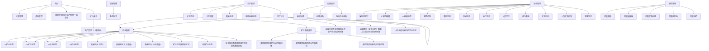

# 自动化产出：动态 UI 页面架构拓扑

这是由 ExplorerAgent 在自主探索过程中，基于视觉推断自动动态构建与补全的页面层级与功能架构图。

```mermaid
graph TD
    N0["首页"] --> N1["证照管理"]
    N0["首页"] --> N2["资料管理"]
    N0["首页"] --> N3["顶部导航栏的‘生产管理’一级菜单"]
    N0["首页"] --> N4["矿山简介"]
    N4["矿山简介"] --> N5["生产管理（一级菜单）"]
    N6["资源管理"] --> N7["勘探报告"]
    N8["生产管理"] --> N9["矿仓监测"]
    N9["矿仓监测"] --> N10["矿仓数据"]
    N10["矿仓数据"] --> N11["1#矿仓标签"]
    N10["矿仓数据"] --> N12["2#矿仓标签"]
    N10["矿仓数据"] --> N13["3#矿仓标签"]
    N10["矿仓数据"] --> N14["4#矿仓标签"]
    N10["矿仓数据"] --> N15["表格列头 '库存t'"]
    N10["矿仓数据"] --> N16["表格列头 '入仓重量t'"]
    N10["矿仓数据"] --> N17["表格列头 '出仓重量t'"]
    N9["矿仓监测"] --> N18["矿仓数据弹窗"]
    N18["矿仓数据弹窗"] --> N19["弹窗底部的'装矿外运'导航按钮"]
    N18["矿仓数据弹窗"] --> N20["弹窗底部右侧的箭头导航图标"]
    N18["矿仓数据弹窗"] --> N21["弹窗底部的多箭头导航控件"]
    N8["生产管理"] --> N22["卡车调度"]
    N8["生产管理"] --> N23["能耗监测"]
    N8["生产管理"] --> N24["胶带运输监测"]
    N8["生产管理"] --> N25["生产统计"]
    N25["生产统计"] --> N25["生产统计"]
    N25["生产统计"] --> N26["采掘计划与统计图表上方的‘年’时间切换按钮"]
    N25["生产统计"] --> N27["运输概况（矿仓出矿）图表上方的‘月’时间切换按钮"]
    N25["生产统计"] --> N28["1#矿仓的当前料位显示区域"]
    N25["生产统计"] --> N10["矿仓数据"]
    N10["矿仓数据"] --> N12["2#矿仓标签"]
    N10["矿仓数据"] --> N13["3#矿仓标签"]
    N10["矿仓数据"] --> N29["矿仓库存数图表区域"]
    N10["矿仓数据"] --> N30["全部矿仓标签"]
    N10["矿仓数据"] --> N31["矿仓库存数图表区域下方的表格数据区域"]
    N32["设备管理"] --> N33["采掘设备"]
    N32["设备管理"] --> N34["运输设备"]
    N32["设备管理"] --> N35["特种作业设备"]
    N36["安全管理"] --> N37["采场可视化"]
    N36["安全管理"] --> N38["人车防碰撞"]
    N36["安全管理"] --> N39["AI视频监控"]
    N36["安全管理"] --> N40["双控机制"]
    N36["安全管理"] --> N41["通风监测"]
    N36["安全管理"] --> N42["环境监测"]
    N36["安全管理"] --> N43["地压监测"]
    N36["安全管理"] --> N44["人员定位"]
    N36["安全管理"] --> N45["应急救援"]
    N36["安全管理"] --> N46["安全培训"]
    N36["安全管理"] --> N47["人员安全档案"]
    N36["安全管理"] --> N48["车辆定位"]
    N49["智控管理"] --> N50["智能溜破"]
    N49["智控管理"] --> N51["智能破碎锤"]
    N49["智控管理"] --> N52["智能胶带运输"]
    N49["智控管理"] --> N53["智能供配电"]
    N49["智控管理"] --> N54["智能巡检"]
```
